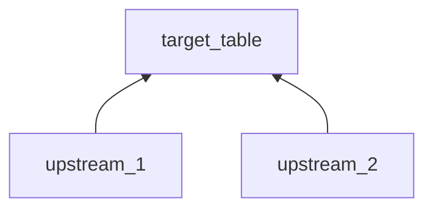
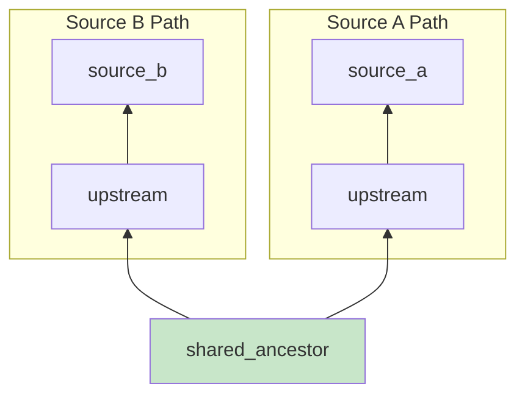

# Research

Trace lineage, review code, and complete research.md with all findings.

**Prerequisite:** research.md must exist with Project Map (from `/opsx:discover`)

**Output:** Completed research.md

**Next step:** `/opsx:analyze`

---

## Input

- A change name with research.md containing Project Map
- Or infer from conversation / auto-select if only one exists

---

## Steps

### 1. Load Project Map

Read research.md and extract all resources from Project Map.

If no change specified:
- Auto-select if only one exists
- Otherwise ask user which change to use

### 2. Research each source

**Execute SEQUENTIALLY — one source at a time.**

For each source in Project Map:

#### 2a. Discovery — trace lineage

```
TaskCreate:
  subject: "Discovery: <source_name>"
  description: "Trace lineage and identify dependencies"
```

Invoke `/bigquery-lineage` in **iterative mode** (level by level):

```
Skill: /bigquery-lineage
Input: <FQDN>
```

**Detect linked datasets:** If output shows `# linked dataset: <target> -> <source>`:
- Document in research.md under "Linked Datasets" section
- Target = project where data is consumed (via Analytics Hub)
- Source = project where data originates
- Upstream tables will be in the source project

**CRITICAL:** Linked dataset = same data, not a copy. No sync, no differences — ignore cross-project references as discrepancy candidates.

**At each level, decide:**
- Which branches are relevant?
- Which can be skipped?
- When to stop?

**For discrepancies:**
- Trace EACH source independently
- Find convergence (shared ancestor) or divergence (separate origins)

**For NEW dependencies found:**
- Invoke `/locate` to find code path
- Add to Project Map in research.md

TaskUpdate: status → `completed`

#### 2b. Code Review — understand technical logic

```
TaskCreate:
  subject: "Code Review: <source_name>"
  description: "Read and document technical logic"
```

**Read the code fully:**
- Field definitions relevant to the analysis
- Filters, WHERE clauses, JOIN conditions
- Business logic encoded in SQL

**If something is unclear:** Ask user, don't assume.

TaskUpdate: status → `completed`

### 3. Complete research.md

Fill all remaining sections:

#### 3a. Source Registry

Update with all sources analyzed:

| # | Type | Resource | Code Path | FQDN | Status | Key Contribution |
|---|------|----------|-----------|------|--------|------------------|

#### 3b. Data Lineage

For each source, document lineage using Mermaid:

### Table: `<FQDN>`



**Key transformations:**
- upstream_1: provides X field
- upstream_2: provides Y field with filter Z

**For discrepancies, show both paths:**

### Lineage Comparison



**Convergence point:** `shared_ancestor`

#### 3c. Code Review Findings

For each model/view analyzed:
- Key business logic
- Filters and conditions
- Potential issues or gaps

#### 3d. Feasibility Verdict

**Status**: Feasible / Partially Feasible / Not Feasible

**Available now:**
- ...

**Gaps:**
- ...

If "Not Feasible": STOP and discuss with user.

---

## Output

Summarize:
- Sources researched: N
- Lineage depth reached
- Key findings
- Feasibility verdict

**Always end with:**
> "Research complete. Run `/opsx:analyze` when ready to execute."

---

## Principles

- **Iterative lineage**: Level by level, decide which branches matter
- **One source at a time**: Complete fully before starting next
- **Ask, don't assume**: If logic is unclear, ask user
- **Document as you go**: Update research.md after each source

---

## Guardrails

- Never skip lineage for discrepancy analysis
- Never infer business logic — read the code
- Stop and discuss if feasibility is "Not Feasible"
